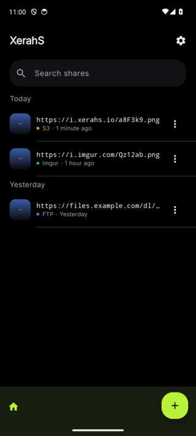
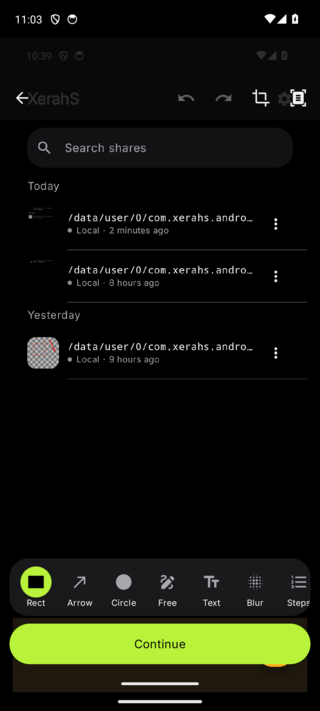
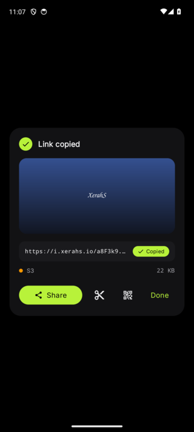
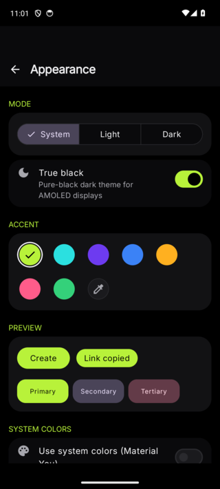

# XerahS Android

> **Early Development** - This project is under active development. Expect bugs, breaking changes, and incomplete features. Feedback and bug reports are welcome.

> **Disclaimer** - This is an unofficial, third-party client inspired by [XerahS](https://xerahs.com/) and [ShareX](https://getsharex.com/). It is not affiliated with, endorsed by, or associated with either project or their developers. No code from XerahS or ShareX was used; this app was built entirely from scratch.

An Android app for turning an image into a shareable link in seconds. Pick a screenshot or photo, mark it up, upload it to your destination of choice, and the link lands back on your home screen, already copied.

<p align="center">
  
  
  
  
</p>

## Design

XerahS uses a dark-first "Signal on Black" interface: a true-black canvas, one accent color you can change, and a monospace style for links and file data so they are easy to scan. The home screen opens to your recent shares as a timeline, and the whole pick to share flow is built to stay under your thumb.

## Features

### Workflow
- **Shares timeline**: Home opens to your recent uploads. Tap a row to reopen it, or copy the link again from the row menu.
- **One step to the picker**: The create button, a Quick Settings tile, and a long-press app shortcut all open the system photo picker directly.
- **Canvas-first editor**: The image fills the screen while the tools sit in a compact drawer that reveals options only for the selected tool.
- **Decisive upload**: The destination shows on the action button, switchable from a sheet, with progress drawn over the image.
- **Share card**: A clear "Link copied" confirmation with the URL, a QR code, and one-tap link shortening.

### Editor (12 tools)
Rectangle, ellipse, line, arrow, freehand, text with backgrounds, numbered steps, blur, pixelate, highlight, spotlight, and a magnifier loupe. Tap to select, move, resize or delete annotations, adjust per-annotation opacity, pinch to zoom and pan, full undo and redo, and a crop mode with a draggable grid.

### Power features
- **Text recognition (OCR)**: Pull the text out of any image on device, then copy or share it.
- **QR codes**: Generate a scannable QR of the result link.
- **Link shortening**: Shorten the link with is.gd in one tap.
- **Custom uploaders**: Import a ShareX `.sxcu` uploader file into the Custom HTTP destination.

### Upload and organize
- **Destinations**: Amazon S3, Imgur, FTP, SFTP, Custom HTTP, or save locally.
- **Multi-image upload**: Pick and upload several images at once with batch progress.
- **Upload profiles**: Save named configurations per destination.
- **Duplicate detection**: A SHA-256 check warns you before re-uploading the same image.
- **Quality controls**: JPEG compression and max-dimension resize before upload.
- **Custom file naming**: Token-based patterns with `{original}`, `{date}`, `{time}`, `{timestamp}`, `{random}`.
- **Albums and tags**: Group uploads and filter your history.
- **Connection testing**: Test S3, FTP, and SFTP from settings.

### S3 tools
- **S3 Explorer**: Browse, search, preview, download, and delete bucket files with folders, breadcrumbs, list and grid views, thumbnails, sorting, rename and move.
- **Bucket stats**: File-type breakdown, age distribution, storage growth, and a monthly cost estimate.

### Personalization and more
- **Theme editor**: Light, dark, and system modes, a true-black option, a set of accent presets, and a custom color picker. Any accent you pick is run through a contrast check so text stays readable in both light and dark. Material You is available as an opt-in.
- **Biometric lock**: Lock the whole app or just credential screens behind fingerprint or face unlock.
- **Settings backup**: Export and import all settings as JSON.
- **In-app updates**: Check for new versions and view the changelog from GitHub Releases.
- **Share intent**: Receive images shared from other apps.
- **Single-screen onboarding**: Pick a default destination and you are in.

## Architecture

Multi-module clean architecture with Jetpack Compose. Dependencies flow `app -> feature/* -> core/*`, and feature modules do not depend on each other.

```
app/                  Application, navigation, theme, the home timeline shell
core/
  common/             Utilities, contrast-safe color engine, QR and .sxcu parsers, AWS V4 signer
  domain/             Models and repository interfaces
  data/               Room database, DataStore, encrypted credential storage, uploaders' configs
  ui/                 Shared Compose components
feature/
  capture/            System photo picker entry
  annotation/         Canvas-based markup editor
  upload/             Upload logic for S3, Imgur, FTP, SFTP, Custom HTTP, plus WorkManager
  history/            The shares timeline, search, and the share card
  s3explorer/         S3 bucket browser
  settings/           Settings, theme editor, destination configs, profiles, stats
```

## Tech Stack

| Category | Libraries |
|---|---|
| UI | Jetpack Compose, Material 3, Compose Navigation |
| DI | Dagger Hilt |
| Database | Room |
| Preferences | DataStore, EncryptedSharedPreferences |
| Networking | Retrofit, OkHttp |
| Image loading | Coil |
| Background work | WorkManager |
| Text recognition | ML Kit |
| QR codes | ZXing |
| Security | AndroidX Biometric |
| FTP and SFTP | Apache Commons Net, JSch |
| Fonts | Inter, JetBrains Mono |

## Requirements

- Android 8.0 (SDK 26) or newer
- JDK 17 or newer

## Building

```bash
./gradlew assembleDebug
```

Install on a connected device:

```bash
adb install app/build/outputs/apk/debug/app-debug.apk
```

## Upload Destinations

| Destination | Notes |
|---|---|
| **Amazon S3** | Custom endpoints (MinIO, DigitalOcean Spaces), path-style, ACL, custom public URL |
| **Imgur** | Anonymous or OAuth, token refresh |
| **FTP** | FTPS support, passive mode, auto directory creation |
| **SFTP** | SSH key authentication, passphrase support |
| **Custom HTTP** | Your own endpoint, with ShareX `.sxcu` import |
| **Local** | Save to device storage |

## License

This project is licensed under the [GNU General Public License v3.0](LICENSE).
