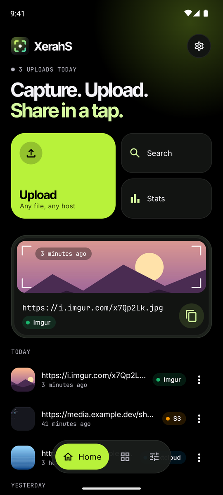
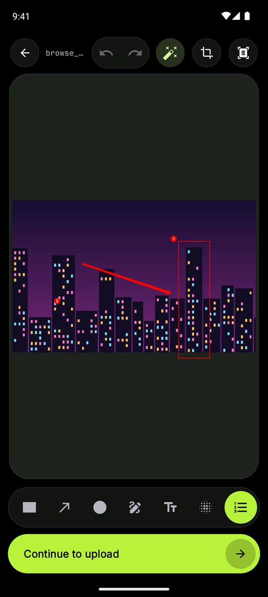
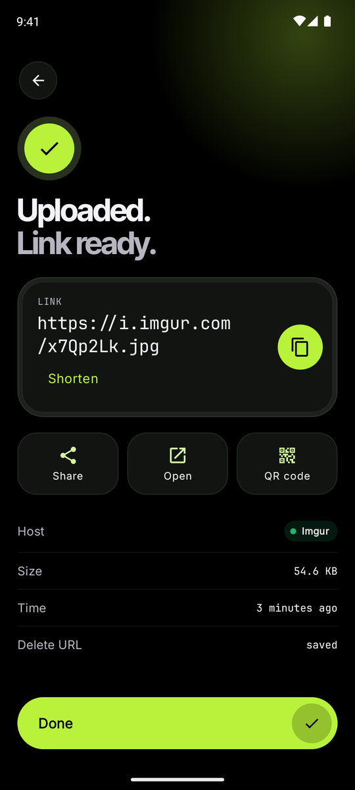
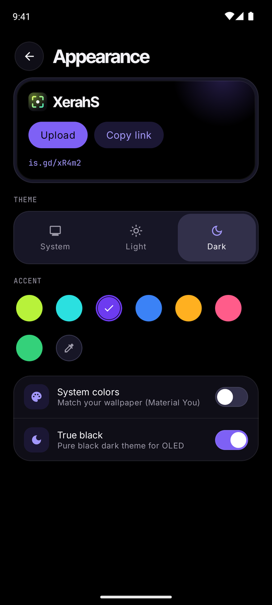

<p align="center">
  
</p>

<h1 align="center">XerahS for Android</h1>

<p align="center">
  Capture. Upload. Share in a tap.<br>
  A ShareX-style uploader for Android.
</p>

<p align="center">
  <a href="https://github.com/unicxrn/XerahS-Android/releases/latest"></a>
  
  <a href="LICENSE"></a>
</p>

<p align="center">
  <a href="https://unicxrn.github.io/XerahS-Android/"><b>Website</b></a> ·
  <a href="https://github.com/unicxrn/XerahS-Android/releases/latest"><b>Download</b></a> ·
  <a href="https://github.com/unicxrn/XerahS-Android/issues">Report a bug</a>
</p>

<p align="center">
  
  
  
  
</p>

Pick a screenshot or any other file, mark it up if you want, and send it to Imgur, your own S3 bucket, Nextcloud or a server you run. When the upload finishes, the link is already on your clipboard.

> [!NOTE]
> XerahS for Android is unofficial. It's inspired by [XerahS](https://xerahs.com/) and [ShareX](https://getsharex.com/) but isn't affiliated with or endorsed by either project, and it uses none of their code. It's also still early, so expect the odd rough edge.

## Install

Download the APK from the [latest release](https://github.com/unicxrn/XerahS-Android/releases/latest) on your phone and open it. If Android asks, allow installs from your browser. New versions show up in the app under Settings, Updates.

You need Android 8.0 or newer.

## What it does

**Upload anything.** Images, PDFs, videos and other files. Share a file into XerahS from another app, use the Quick Settings tile, or pick from your gallery. Several files can go up in one batch.

**Mark it up first.** The editor has twelve tools: rectangle, ellipse, line, arrow, freehand, text, numbered steps, blur, pixelate, highlight, spotlight and a magnifier. You can crop, add a border or shadow, and pull text out of an image with on-device OCR.

**Send it where you want.** Each destination keeps its own settings, and upload profiles let you switch between setups in one tap.

| Destination | Notes |
|---|---|
| Imgur | Anonymous or signed in |
| Amazon S3 | Also Cloudflare R2, MinIO, DigitalOcean Spaces and other S3-compatible storage |
| Nextcloud | Uploads to a folder and creates a share link |
| Immich | Sends photos and videos to your library |
| GitHub Gist | For text and code |
| FTP and FTPS | Passive mode, creates folders as needed |
| SFTP | Password or SSH key |
| Custom uploaders | Import ShareX `.sxcu` files, including `{json:}`, `{regex:}`, `{xml:}` and input prompts. Presets for XBackBone, Pastebin and Bitly |
| On your phone | Saves locally |

**Decide what happens next.** Copy the link, open the share sheet, open it in the browser or show a QR code, per profile or for every upload. Links can be shortened with is.gd or your Bitly account.

**Find it again later.** History keeps every upload with its link, host and thumbnail. Search it, sort uploads into albums and tags, and delete a file from the host when you're done with it. Upload the same image twice and XerahS offers the link you already have.

**Browse your bucket.** The S3 explorer lists, searches, renames, moves and downloads files. GIFs animate and videos play in the preview, and there's a stats view with storage use and a cost estimate.

**A few extra tools.** Resize or convert a batch of images and add a watermark, read a QR code from a picture, check a file's hash, or pick a color from an image.

**Make it look how you like.** Light, dark or system theme, seven accent colors or your own, Material You, and a true black mode for OLED screens. Every accent goes through a contrast check, so text stays readable.

**Keep it private.** Passwords and keys stay in Android's encrypted storage. Backups are encrypted with a passphrase you pick, and you can lock the app behind your fingerprint.

## Build it yourself

You need JDK 17 or newer and the Android SDK.

```bash
./gradlew assembleDebug
adb install app/build/outputs/apk/debug/app-debug.apk
```

The app is written in Kotlin with Jetpack Compose and follows a multi-module layout where `app` depends on `feature/*` and features depend on `core/*`. Features never depend on each other.

```
app/            Navigation, theme, main activity
core/common     Color engine, AWS signing, .sxcu parsing, utilities
core/domain     Models and repository interfaces
core/data       Room, DataStore, encrypted credentials, uploaders
core/ui         Shared Compose components
feature/        capture, annotation, upload, history, s3explorer, tools, settings
site/           The website, deployed to GitHub Pages
```

It uses Hilt, Room, WorkManager, DataStore, OkHttp, Coil, Media3, ML Kit and ZXing. The fonts are Inter, Inter Tight and JetBrains Mono, all under the SIL Open Font License.

## Contributing

Bug reports and pull requests are welcome. If you're planning something big, open an issue first so we can talk it through.

## License

[GPL-3.0](LICENSE)
